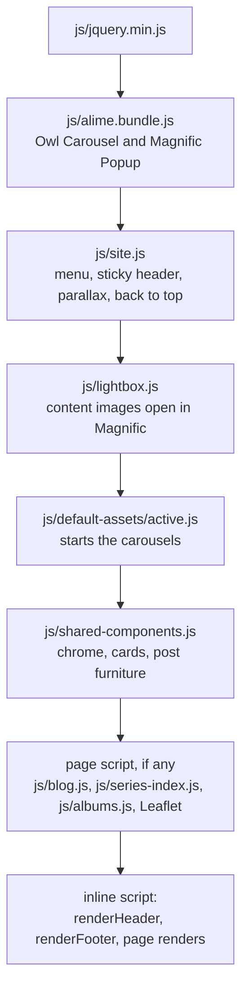
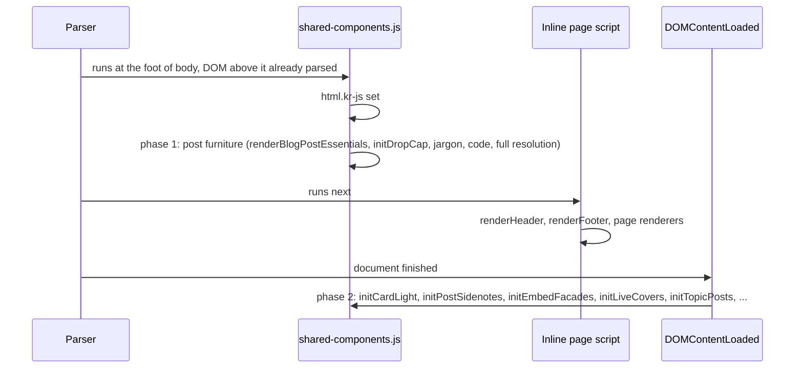
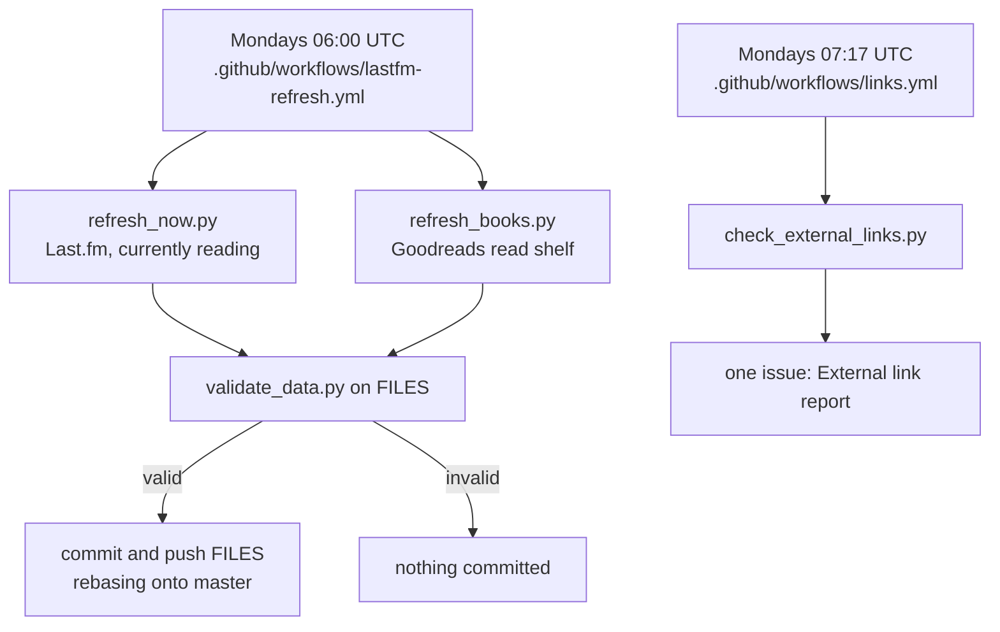

# Architecture

kenreid.co.uk is a static site: HTML pages, one stylesheet, a handful of
scripts and a folder of JSON, served by GitHub Pages straight from the
`master` branch. There is no framework and no build step on the server.
The things a build step would normally produce (a minified stylesheet,
share images, a feed, a sitemap, the metadata in every post's head) are
produced by Python scripts under `.github/scripts/`, run locally, and
committed. CI runs the same scripts in `--check` mode and fails when a
committed output no longer matches what its script would write.

Why this shape. Pages serves the repository as it is, so whatever is in
`master` is the site, byte for byte, and a reader never waits on a build
that could fail at deploy time. The cost is that a generated file can go
stale, and the checks exist to catch exactly that (see
[TESTING.md](TESTING.md)).

## Page anatomy

Every page is built from the same pieces, so a reader who knows one page
knows them all. The head carries, first to last (the order of 2, 3 and 7
varies a little between pages and does not matter):

1. An inline script that sets `data-theme` on `<html>` from
   `localStorage` (default `dark`) before anything paints. It has to be
   inline and first: a theme applied by a deferred script would flash
   the other theme on every load. (The essay:
   [Dark Mode That Doesn't Flash](https://www.kenreid.co.uk/blog/dark-mode-that-doesnt-flash.html).)
2. Meta, Open Graph and Twitter tags, the canonical link.
3. `js/analytics.js`, deferred. It queues the page view at once and
   loads Google's library only after `load` and an idle moment, so
   counting a visit never competes with drawing the page.
4. A preload with `fetchpriority="high"` for the opening photograph, the
   largest paint on the page, which the browser would otherwise find
   late (it is a CSS background).
5. `style.min.css?v=<stamp>`, the one stylesheet.
6. `js/theme.js` and `js/palette.js`, deferred: the theme toggle and the
   Ctrl+K palette, which builds nothing until it is first opened.
7. JSON-LD.

The body is `#header-section` (filled by `renderHeader`),
`main#main-content`, the page's opener and sections, an optional
`#instagram-section` (the photo strip, `renderPhotoStrip`), and
`#footer-section` (`renderFooter`). Then the scripts, at the foot, in this
order:

A synchronous page script comes straight after the shared scripts and
before the inline renderers (`blog.html` also calls `initBlog()` in a
line of its own between the two). `gallery.html` is the one page that
differs: its inline `initGallery` listener sits between `js/lightbox.js`
and `js/default-assets/active.js`.

Two stacks use that order. Pages with a carousel (the homepage hero, the
photo strip) or a Magnific lightbox load all of it, and so do posts,
whose photographs open in the lightbox. Pages with neither load only
`js/site.js` and `js/shared-components.js`: `404.html`, `privacy.html`,
`colophon.html`, `quotes.html`, `series.html` and the series landing
pages. jQuery is loaded only for Owl Carousel and Magnific Popup, the two
plugins in `js/alime.bundle.js`. The only first-party code that touches
it is the code driving those plugins: `js/default-assets/active.js`,
`js/lightbox.js`, the lightbox in `js/gallery.js`, and `renderPhotoStrip`
and `openKrLightbox` in `js/shared-components.js`. New code should not
use it.

| Page type | Example | Its own scripts, and where they load |
|---|---|---|
| Top-level page | `about.html` | none; the inline script calls `renderHeader`, `renderPhotoStrip`, `renderFooter` |
| Homepage | `index.html` | inline renderers for its figures and quotation; `js/hero-evolve.js` deferred after the shared scripts |
| Blog listing | `blog.html` | `js/blog.js` after `js/shared-components.js`, then `initBlog()` |
| Series index | `series.html` | `js/series-index.js` after the shared scripts, then `initSeriesIndex()` |
| Series landing | `series-feedback.html` | `renderSeriesPage()` in the inline script |
| Gallery | `gallery.html` | `js/gallery.js` deferred in the head; `initGallery()` on DOMContentLoaded |
| Reading pages | `literature.html`, `books.html` | `js/literature.js`, `js/bookshelf.js`, `js/bookwall.js`, deferred in the head |
| Music | `music.html` | `js/albums.js` after the shared scripts |
| Photo map | `map.html` | `js/vendor/leaflet/leaflet.css` in the head, `js/vendor/leaflet/leaflet.js` after the shared scripts |
| Post | `blog/rating-systems.html` | nothing of its own; the post furniture starts by itself (below) |
| Interactive post | `blog/particle-swarm-live.html` | `js/kr-viz.js` and an inline script that mounts the demo |
| 404 | `404.html` | inline; `<html data-kr-root="/">` (see Paths) |
| Offline fallback | `offline.html` | inline only; served by the service worker |

A deferred page script (`js/gallery.js`, `js/literature.js`) runs after
the whole document has parsed, which is after the synchronous
`js/shared-components.js` at the foot, so it may call the shared globals
directly. A page script loaded synchronously after the shared scripts
(`js/blog.js`) can too.

### Paths

- **Top-level pages use root-absolute paths** (`/js/site.js`,
  `/style.min.css`). They are served from the root, and the local server
  in the README serves from the repository root to match.
- **Posts use paths relative to `blog/`** (`../js/site.js`). This is the
  template `generate_post_head.py` writes and the audit's script-drift
  rule compares, so write them that way.
- **Script that builds a link** cannot know how deep the page is. It
  prefixes `siteRootPrefix()` (in `js/shared-components.js`) to a
  site-relative path, and fetches through `krFetchJson`, which does the
  same.
- **The 404 page** is served by Pages for every missing URL at any
  depth, so the same document arrives at `/<missing>` and
  `/blog/<missing>.html`.
  It declares `<html data-kr-root="/">`, which `siteRootPrefix()` returns
  instead of guessing.
- **A `url()` inside a CSS custom property is site-absolute**
  (`--kr-opener-img: url(/img/photography/hero/<n>.webp)`,
  `--kr-cover`). Chrome resolves a relative `url()` in a custom property
  against the stylesheet that reads it, not against the page, so a
  relative one from a post would be fetched from the wrong folder.
- **Asset stamps.** Pages request the stylesheet and first-party scripts
  with a `?v=` query. Posts get it from `ASSET_QUERY` in
  `generate_post_head.py` (`--fix` writes it); top-level pages carry it
  by hand; the three hover-sketch files use `KR_COVERS_VERSION` in
  `js/shared-components.js`. The service worker fetches code network
  first, so an ordinary deploy needs no new stamp. The stamps exist for
  one handover: change them only when replacing a worker that was not
  network first for code, and then change `ASSET_QUERY` and the pages'
  hand-written `?v=` together (`sw.js`'s header has the history).

## shared-components.js: two boot phases

`js/shared-components.js` is one classic script, loaded synchronously at
the foot of `<body>`, that defines plain globals (its header lists every
one, grouped). It starts work at two moments, and a new behaviour belongs
in one of them for a reason.

**Phase 1, at parse.** The last lines of the file call
`renderBlogPostEssentials()`, `renderStoryPostEssentials()`,
`renderFloatingBlogShare()`, `initDropCap()`,
`autoCollapseTopJargonBox()`, `applyJargonTooltips()`,
`initCopyQuotes()`, `initLightboxFix()`, `initFullResMode()` and
`initCodeHighlighting()`. The script sits below the article, so the
article is already in the DOM; running now means the end band, the meta
line and the drop cap are in place before the first paint, and nothing
the reader sees shifts when they arrive. Each returns at once on a page
without a post: most key on `.blog-post`, `renderStoryPostEssentials` on
`.story-post`, and `renderFloatingBlogShare` on either. `initCopyQuotes`
is the exception: it applies to any `blockquote` on any page. Use this
phase for anything that changes the layout of a post.

**Phase 2, DOMContentLoaded.** The listener near the end of the file
runs the page-wide behaviours: `initCardLight`, `initPostSidenotes`,
`initLightboxZoom`, `annotateNewTabLinks`, `updateLastfmStats`,
`renderNowStrip`, `initCountUpStats`, `initLazyImageFade`,
`initEmbedFacades`, `initHeroTransitions`, `initScrollFlourishes`,
`initLiveCovers`, `initTopicPosts`, `krArmPostPrerender` (only when a
card is already in the markup; cards drawn later arm it from
`createBlogCardElement`) and `krLabelModKeys`, and it starts a
`MutationObserver` that runs `annotateNewTabLinks` again on whatever is
added later. By then the page's inline script has run, so the header,
the footer and anything a page renderer drew are in the DOM too. Use this
phase for behaviour that has to find elements a renderer creates, or that
adds listeners rather than layout.

**The page's own renderers** (`renderHeader`, `renderFooter`,
`renderPhotoStrip`, `renderSeriesPage`) are called by name from the
inline script that follows the shared scripts. They are not self-starting
because each page decides which it wants and passes its own options
(`renderHeader('header-section', { basePath: '/', active: 'about' })`).

**Markup hosts start themselves.** A few components are driven by an
attribute instead of a call: `[data-topic-tags]` (`initTopicPosts`),
`[data-live]` (the live-cover engine), `.kr-embed-facade[data-embed-src]`
(`initEmbedFacades`). Adding one to a page is markup only; see
[CONVENTIONS.md](CONVENTIONS.md#data--hosts).

`js/site.js` runs before it and owns the header's behaviour (the phone
menu and its focus handling, `window.krNavMenu`, the sticky state);
`renderHeader` calls `window.krInitNav()` once the markup exists.

## What loads later, or only on demand

| Piece | When | Where |
|---|---|---|
| Google Analytics | after `load`, at the next idle moment | `js/analytics.js` |
| Hover sketches | first `pointermove` or `focusin`, only with `(hover: hover)` and motion allowed; phones never fetch them | `krLoadLiveCovers` in `js/shared-components.js` loads `js/live-covers.js`, `js/covers.js`, `js/covers-site.js` |
| Syntax highlighting | a post with `pre code[class*="language-"]` | `initCodeHighlighting` loads `js/prism-loader.js`, which loads Prism from jsDelivr |
| Comments | the end band is built at parse; giscus loads its frame lazily | `buildGiscusSection` |
| Video and other embeds | a click on the facade | `initEmbedFacades` swaps in the iframe |
| Homepage hero photographs | slides after the first, after load and idle | the inline painter in `index.html`, from `data-bg` |
| Prerendered posts | about 200ms of hover on a post card, desktop only, never under Save-Data | `krArmPostPrerender` and `KR_PRERENDER_RULES` |
| The palette's data | first open | `js/palette.js` |
| Gallery tiles | a batch at a time as the reader scrolls | `js/gallery.js` |

## The generators

Everything generated is written by a script in `.github/scripts/`, and
`run_checks.py` holds the one ordered list of them (`CHECKS`). The order
is dependency order: each generator comes after everything it reads, so
`run_checks.py --fix` can walk the list once and every step sees its
inputs already rebuilt.

```mermaid
flowchart LR
    posts["data/posts.json<br/>and the post HTML"] --> markup["normalize_post_markup.py"]
    markup --> rt["generate_read_times.py"]
    rt --> facets["generate_post_facets.py"]
    facets --> opener["apply_post_opener.py"]
    opener --> og["generate_og_images.py"]
    og --> related["generate_related_posts.py"]
    related --> dims["generate_photo_dims.py --stamp-img"]
    dims --> feed["generate_feed.py"]
    feed --> quotes["generate_quote_wall.py"]
    quotes --> pubs["generate_publications.py"]
    pubs --> listing["generate_listing_fallback.py"]
    listing --> sitemap["generate_sitemap.py"]
    sitemap --> mono["detect_monochrome.py"]
    mono --> head["generate_post_head.py --fix"]
    head --> css["minify_css.py"]
    css --> colophon["generate_colophon.py"]
```

Why this order, in the places it matters:

- The opener prints the read time, so it follows the read times; the
  share image draws the opener, so it follows the opener.
- The photo dimensions are stamped into post bodies, and the feed copies
  post bodies, so the feed comes after.
- The stylesheet pruner keeps only rules that tracked HTML and JS use, so
  the build follows every generator that writes HTML.
- The post head carries the word count and read time as JSON-LD, so it
  follows the read times, and it comes before the stylesheet build
  because the pruner reads every inline script, the JSON-LD it rewrites
  included.
- The colophon measures the repository (bytes, counts, checks per push),
  and every generator above can move one of its figures, so it is last.

`python .github/scripts/run_checks.py --list` prints the registry with
each entry's flags. [TESTING.md](TESTING.md) covers what each check
guards.

## The weekly jobs

**Live data** (`.github/workflows/lastfm-refresh.yml`). The `FILES` list
in the workflow is the six files it owns: `data/lastfm.json`,
`data/now.json`, `data/lastfm-history.json`, `data/topalbums.json`,
`data/books.json` and `data/reading.json`. Each source fails on its own:
a failed fetch keeps that source's old values, the other sources still
update, whatever refreshed is validated against `data/schema/` and
committed, and a last step turns the run red if any source failed. It is
the only workflow that writes to the repository (`links.yml` can write
issues only), and it commits on its own, so pull before you push on a
Monday. It needs the `LASTFM_API_KEY` repository
secret. (The essay:
[Letting Robots Update Your Homepage](https://www.kenreid.co.uk/blog/letting-robots-update-your-homepage.html).)

**External links** (`.github/workflows/links.yml`). Every link that leaves
the site, checked politely (one request at a time per host) and reported
in one issue that opens while any link is gone and closes when none is.
It never fails a run: the answer depends on other people's servers. It
is not in `run_checks.py` for the same reason.

**Site checks** (`.github/workflows/site-checks.yml`) runs on every push
to `master` and on pull requests. Pages deploys independently of it.

## The service worker

`sw.js` gives offline reading: pages a reader has seen open again without
a connection, and `offline.html` lists them when an unseen page is asked
for. Navigations, scripts, stylesheets and `data/*.json` go to the
network first and fall back to the cache, so a fresh page never runs
stale code or shows last week's data; images and fonts are served from
the cache and refreshed in the background. Three caches (`-core`, `-img`,
`-pages`), each named from `VERSION`. The file's header explains each
choice, what to bump and when, and why the `?v=` stamps protect the
first page after a new worker takes over. Every entry in its `PRECACHE`
list must be a tracked file, or the worker never installs; the audit
checks that. (The essay:
[Reading This Site Offline](https://www.kenreid.co.uk/blog/reading-this-site-offline.html).)

## Where to change what

| To change | Edit | Then run |
|---|---|---|
| Header, nav, recent posts in the menu | `renderHeader` in `js/shared-components.js`; the phone menu's behaviour in `js/site.js` | smoke suite |
| Footer, or which pages it lists | `KR_PAGES` and `renderFooter` in `js/shared-components.js` | audit, `js-tests` |
| The Ctrl+K palette | `js/palette.js` (pages come from `KR_PAGES`) | smoke suite |
| Any colour, size or spacing | a token in `style.css` §01, or the component's section | `minify_css.py`, `check_css.py --check` |
| A post card | `createBlogCardElement` in `js/shared-components.js` and the baked copy in `generate_related_posts.py`, together | `generate_related_posts.py`, `tests/test_generate_related_posts.py` |
| The end of every post | `renderPostEnd` and its helpers in `js/shared-components.js`; CSS in §10 | `check_post_template.py` |
| The post opener | `apply_post_opener.py`, CSS in §06 | `apply_post_opener.py` |
| The post head template | `generate_post_head.py` | `generate_post_head.py --fix` |
| Share images | `generate_og_images.py` (bump `RENDERER`) | `generate_og_images.py` |
| Blog filters, search, sort | `js/blog.js`; the shared panel parts in `js/shared-components.js` | smoke suite |
| Gallery layout or lightbox | `js/gallery.js`, `js/lightbox.js`, CSS in §13 | smoke suite |
| The photo map | `map.html` (its script and styles are inline), `data/photo-locations.json` | smoke suite |
| Reading pages | `js/bookshelf.js`, `js/literature.js`, `js/bookwall.js`, CSS in §14 | `js-tests`, smoke suite |
| The music crate | `js/albums.js`, CSS in §15 | smoke suite |
| Publications on Data Science | `data/publications.json` | `generate_publications.py` |
| The quote wall | `data/quotes-all.json` | `generate_quote_wall.py` |
| Hover sketches | `js/covers.js` (posts), `js/covers-site.js` (elsewhere) | `check_live_covers.py --check`, smoke suite |
| The interactive demo engine | `js/kr-viz.js`, CSS in §12 | `viz_verify.py`, smoke suite |
| Offline behaviour | `sw.js` (bump `VERSION` when caching changes) | `perf_budget.py` (the offline scenario) |
| Theme toggle | `js/theme.js`, the inline head script on every page | smoke suite |
| Analytics | `js/analytics.js` (`GA_ID`) | audit |
| Anything a check enforces | the check, and the doc that describes the rule | `run_checks.py` |

## Adding a page

1. Copy the closest existing page (`about.html` for a page with the photo
   strip, `privacy.html` for a lean one). Keep the head order and the
   script order above.
2. Give it the page opener (`.breadcrumb-area`, markup in
   [DESIGN-SYSTEM.md](DESIGN-SYSTEM.md#page-opener)) and section
   headings. In its `renderHeader` call, set `active` to the header's key
   for it (`home`, `about`, `data_science`, `blog`, `contact`, or
   `'hobbies'` with `hobbiesChild` naming the hobby page), or leave it
   out for a page that is not in the menu, as `colophon.html` and
   `404.html` do.
3. Add an entry to `KR_PAGES` in `js/shared-components.js`:
   `{key, label, href, blurb, inFooter, inPalette, parent?}`. It reaches
   the footer only with `inFooter` set (`'explore'` or `'fine'`) and the
   palette only with `inPalette: true`. The audit fails a top-level page
   with no entry (the `site-map` rule); the pages left out on purpose,
   `404.html` and `offline.html`, are listed in `NOT_IN_SITE_MAP` in
   `audit_site.py`. The header menu is written by hand, not built from
   `KR_PAGES`: if the page belongs in the top menu, add it to
   `renderHeader` too.
4. If it should have a share card of its own, add it to `PAGES` in
   `generate_og_images.py`, run the script, and point `og:image` and
   `twitter:image` at `img/og/page-<name>.jpg`.
5. `git add -N` the new file (the stylesheet pruner reads only tracked
   files), then `python .github/scripts/run_checks.py --fix`. The sitemap
   and the colophon pick the page up.

## Adding a series

A series is a name in `data/posts.json` (`"series": {"name": ..., "part": n}`)
plus a landing page.

1. Copy an existing landing page, such as `series-feedback.html`, to
   `series-<slug>.html`. The slug is `sitelib.series_slug` of the name
   ("Algorithms, Live" is `algorithms-live`), the same rule as
   `seriesPageHref` in the browser. The copy carries the
   `data-series` attribute to change, the `renderSeriesPage()` call and
   the no-script listing markers.
2. Set `blogChild` in its `renderHeader` call, as the other landing
   pages do.
3. Give the first post its `series` entry in `data/posts.json`. The blog
   menu, the series index and the post's series line pick the series up
   from there.
4. `git add -N series-<slug>.html`, then `run_checks.py --fix`: the
   sitemap, the no-script listing (`generate_listing_fallback.py`) and
   the post heads' series JSON-LD are regenerated. The audit fails a
   series without a tracked landing page or a sitemap entry.
